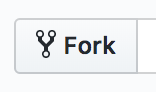
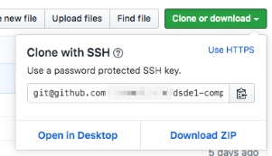
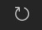
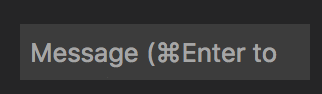
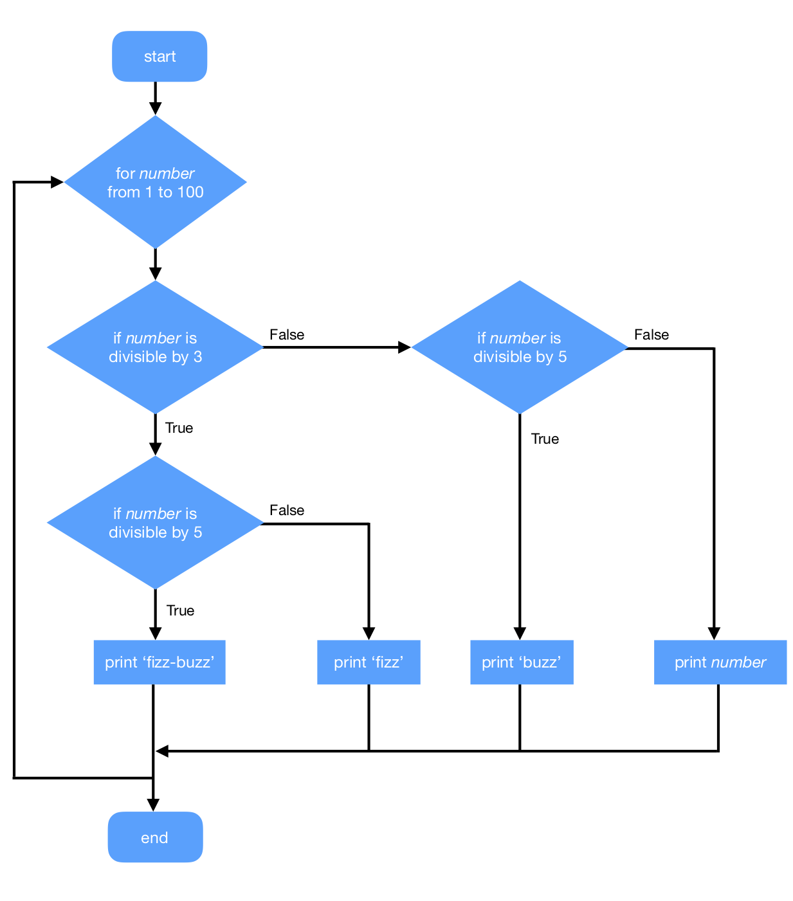
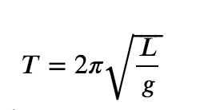

# Week 3 Exercises

# Tuesday - Git and Basic Programming Structure

This week introduces a second important computing tool - version control. We will use Git and Github.

We will then start building more complex code and learn how to document it along the way.

## Setting Up Git
1. If you haven't already, [create an account on Github](http://github.com/) using your Imperial email address, or [add your Imperial email address to an existing Github account](https://help.github.com/en/articles/adding-an-email-address-to-your-github-account).

2. Set up the git config file on your computer by setting the user name and email address. You can optionally set the other fields, if you want. You will need to only do this once. See the [Github tutorial on setting your username] (https://help.github.com/en/articles/setting-your-username-in-git) and [setting the email address in git](https://help.github.com/en/articles/setting-your-commit-email-address). You can also refer to pg 11 of Pro Git ebook for more details. To set the same username and email address for all git repos, in the terminal type the following:

```
git config --global user.name "my-user-name"
git config --global user.email "email@example.com"
```

3. Set up an ssh-key by following [Github's instructions](https://help.github.com/en/enterprise/2.15/user/articles/generating-a-new-ssh-key-and-adding-it-to-the-ssh-agent). Be sure to [follow the last step](https://help.github.com/en/enterprise/2.15/user/articles/adding-a-new-ssh-key-to-your-github-account) and add the key to your Github account.


## Forking a Repository
1. Using the Github online interface, [fork this repo of exercises](https://github.com/theleadingzero/dsde1-computing1) (yes, the one you are looking at right now). This creates a new copy of the repo in your Github user account. Do this by clicking on the fork button. 




## Cloning a Repository
1. You know need to make a local copy of the repository on your computer so that you can edit the code and add files. You don't want to just download the zip file of the repo as it won't contain the change change recorded by git. Go to your fork of the `dsde1-computing1` repo. You could see the green `Clone or download` button on the left side of window. If you don't you are probably in one of the week folders, go to the top folder.

2. Click on the green `Clone or download` button. Make the sure the option is for SSH not HTTPS. Copy the text displayed. It should start with 'git@github.com:'.



3. Open a terminal. `cd` to the location on your computer where you would like the code to be located. Type the following into the terminal, replacing the text `paste-here` with the text you copied from Github.

```
git clone paste-here
```

__TIP__: You could also use a version control application to help you clone and manage repositories. [SourceTree](https://www.sourcetreeapp.com/) is one open source option or you use the [Github Desktop application](https://desktop.github.com/).


## Making Your First Commit
1. You will now use your fork of the repo for storing your weekly exercises. Find the Python code you wrote in Week 2 and add it to the `Week-2` folder on your computer within the `dsde1-computing1` folders now being tracked in your repository.

2. Commit your added code and push it to the repo. We'll walk through the steps here, but you can also reference the [VS Code documentation](https://code.visualstudio.com/docs/editor/versioncontrol#_commit). 

3. Open the file in VS Code. On the left click on the source control button. It will open a new panel in the VS Code interface.


4. Your file should appear underneath CHANGES. If it doesn't, click the refresh button at the top.



5. Hover your mouse over the filename and a `+` will appear on the right. Click on the `+` to add the file to the commit. The filename will move up in the panel underneath STAGED CHANGES to indicate it's been added.

6. Enter a short message like 'Adding file' in the box.



7. Click on the tick mark at the top to make the commit.


8. At the bottom of the window click on the arrows to push the commit to Github (VS Code calls this syncronising).


9. Check in the online interface for Github to check that you can now see your code there.


## Using Github for Exercises From Now On
You now have a repo set up in Github and on your computer. You will start using code files that are in the repo in your exercises. You can also save your exercises in this repo and are encouraged to do so. Using git will become easier only with practice - it's completely normal for it to be frustrating and confusing at first.

Note that you will be expected to use git and Github to fork and commit to repositories in both Assessments.


## Types of If Statements

The basic building block of making decisions in code is the `if`. In Python, it is important to pay attention to the syntax - all the punctuation and spacing.

```
if a > 4:
    print('higher')
```

Note the `:` after the inequality expression and that the code that is only run if the `if` is `True` is indented.

1. Revisit the number-guessing game stretch exercise from last week. Copy the code file to Week-3 in your repo and modify it so that you now use an `if` statement to check if the user's guess is correct or not.

2. The `else` statement can be added to an `if` if there is code you only want to run if the expression in the `if` statement was false. Edit your number guessing game so that the user gets three chances in total to guess the right number. Use a combination of `if` and `else` to check if the current guess was correct, and if it wasn't, then ask the user for another guess.

3. Once you have you 3 chances number guessing game working, draw the flow diagram to illustrate how your code works. You can draw it digitally or draw it on paper and take a photo.

4. Add and commit the diagram to your repo.

5. `elif` is more unique to Python than `if` and `else` which can be seen in lots of other programming languages. `elif` is `else + if`. You use it like an `else`, but when you want to immediately ask a new question or evaluate a new expression based on the `False` answer of the previous question. Do one last rewrite of your number guessing game, this time identifying where you can use `elif` instead of:

``` 
else:
    if new_value == other_value:
```

## Loops

A `while` loop will keep repeating until its expression is `False`. A `for` loop usually has a condition set to limit how many times it repeats, such as couting up to a particular number.

1. Write code that prints starting at 0 and then counts up to 10. (If you don't know how to structure a `while` loop, revisit the resources for the week.)

```
0
1
2
3
```

2. Now reverse it. Write code that prints starting at 10 and then counts backwards:

```
10
9
8
7
```

...all the way until 0. Write one version with a `for` loop and a second version with a `while` loop.

3. Draw flow diagrams for the loops above in exercises 1 and 2.

4. Add and commit the diagrams to your repo.

5. Fizz Buzz is a popular programming exercise often used in coding interviews. The exercise is as follows in text and also below in a flow diagram. Implement this in code.

> Write a program that prints the numbers from 1 to 100. But for multiples of three print "Fizz" instead of the number and for the multiples of five print "Buzz". For numbers which are multiples of both three and five print "FizzBuzz".

__HINT__: Look into the modulo operator `%`.



# Thursday - Writing Functions and Testing Them

## Creating Simple Functions
To warm up, you'll edit a Python file with a collection of simple functions.

1. Open the `toys.py` file in the Week-3 folder of your repo.

2. Follow the instructions in the comments to build up a collection of functions.

3. You can check to see if the functions are working by starting an interactive Python shell (make sure you `cd` to the Week-3 folder) and importing the file. 

```python 
import toys
```

4. You can call functions and see if they do what you expect.

```python
toys.print_inc(5)
```

## A More Complex Function and Handling Exceptions
1. Create a new Python file call `pendulum.py` and save it in the Week-3 folder.

The equation for the period T of a friction-less pendulum is given by


 
where L is the length of the pendulum and g is the acceleration of gravity.

2. Write a Python function called `period()` that takes two arguments: first argument is L and the second argument is g and returns the period T.

3. Within the function, add code that checks whether L and g are valid input values. For example, they shouldn't be strings (instead raise a `TypeError`) or any numbers that would cause the equation to not correctly compute (instead raise a `ValueError`). 

__HINT__: Use the built-in function `isinstance()` to help you figure out what kind of data is in a variable. [W3C School has a short tutorial on how to use it.](https://www.w3schools.com/python/ref_func_isinstance.asp)


## Running Tests
Run the tests for both `toys.py` and `pendulum.py`.

```
python -m unittest test_toys
python -m unittest test_pendulum
```

Correct your code if there are any errors. If the output is that it ran tests and everything is 'OK', then that means your functions passed all the tests. If 'FAILED' is printed instead, then the lines above where it printed 'FAILED' will list what went wrong including what the answer was that your code produced and what the expected answer was.

